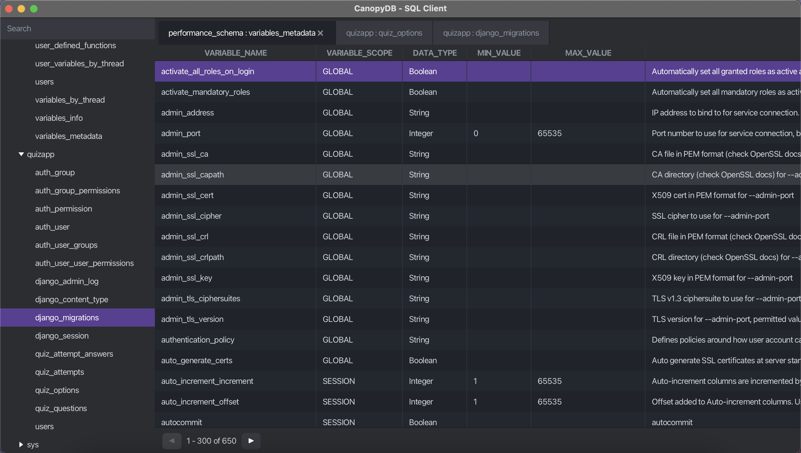

# CanopyDB
*A lightweight, fast, and modern SQL client built for developers.*

---

## Overview

CanopyDB is an open-source SQL client focused on speed, simplicity, and responsiveness.

As backend engineers, we spend a huge portion of our day interacting with databases:
* debugging production issues
* running ad-hoc queries
* inspecting schemas
* validating migrations
* analyzing data

Yet most SQL clients force a tradeoff between:

* performance
* usability
* modern UX
* pricing
* resource consumption

Some tools are incredibly powerful, but feel bloated.
Others are beautiful and fast, but locked behind a paywall.

CanopyDB exists to bridge that gap.



---

## Philosophy

CanopyDB is built around a few core principles:

* **Fast startup**
* **Lightweight resource usage**
* **Responsive UX under heavy workloads**
* **Parallel query execution**
* **Developer-first workflow**
* **Free and open source**

The goal is not to become an enterprise database management platform.

The goal is to build a tool developers genuinely enjoy using every day.

---

## Inspiration

CanopyDB draws inspiration from tools like:

* DBeaver — for its extensive capabilities and thriving OSS ecosystem
* TablePlus — for its elegant UX, minimalism, and responsiveness

CanopyDB aims to combine:

* the openness and extensibility of DBeaver
* with the speed and simplicity developers love in TablePlus

---

## Current Scope

The project is intentionally starting small.

### Initial Focus

* MySQL support
* Multi-tab query workflow
* Parallel query execution
* Responsive JavaFX UI
* Lightweight architecture
* Smooth handling of large query results

---

## Tech Stack

| Area                  | Technology      |
| --------------------- |-----------------|
| Language              | Java 25         |
| UI                    | JavaFX          |
| Database Connectivity | JDBC + HikariCP |
| Build Tool            | Gradle          |
| Database Support      | MySQL (For now) |

---

## Project Goals

CanopyDB is also a deep engineering exploration into:

* desktop application architecture
* concurrent query execution
* JVM performance
* UI responsiveness
* async systems design
* resource-efficient rendering

A major focus of the project is ensuring that heavy database operations never block the user interface.

---

## Planned Features

### Phase 1
* [x] JavaFX application setup
* [x] DB Connection Pool Setup 
* [x] Basic UI Setup
* [x] Threadpool Setup
* [x] Connection Databases and table list fetching
* [x] Handle Connection Loading and Error Properly
* [x] Displaying tables
* [x] Push Notifications
* [ ] Handle Table loading 
* [x] Handle Error Properly
* [x] Multi-tab interface
* [x] Table Single Column Sorting
* [ ] Table Column(s) Sorting
* [x] Table Pagination
* [ ] Table Filtering
* [ ] Connection management
* [ ] Available Table Search
* [ ] Query editor
* [ ] Parallel query execution
* [ ] Query cancellation
* [ ] Result table rendering
* [ ] Query history

### Phase 2

* [ ] Table Data Editing
* [ ] Lazy schema loading
* [ ] Create Tables
* [ ] Delete Tables
* [ ] Table Schema Editing
* [ ] Export results
* [ ] Improved keyboard workflow
* [ ] Streaming large result sets
* [ ] Virtualized table rendering
* [ ] PostgreSQL support
* [ ] Plugin architecture
* [ ] Advanced query tooling

---

## Development Philosophy

CanopyDB intentionally avoids:

* framework bloat
* unnecessary abstractions
* enterprise-heavy architecture
* feature overload

The focus is:

> responsiveness, simplicity, and engineering quality.

---

## Running Locally

### Requirements

* Java 25
* Gradle

### Clone Repository

```bash
git clone https://github.com/your-username/canopydb.git
cd canopydb
```

### Run Application

```bash
./gradlew run
```

---

## Contributing

The project is still in its early stages, but contributions, feedback, and discussions are welcome.

If you're interested in:

* JVM engineering
* desktop tooling
* JavaFX
* database tooling
* concurrent systems

feel free to open an issue or contribute.

---

## License

MIT License

---

## Status

🚧 Early Development

CanopyDB is currently under active development and APIs/architecture may evolve rapidly.
