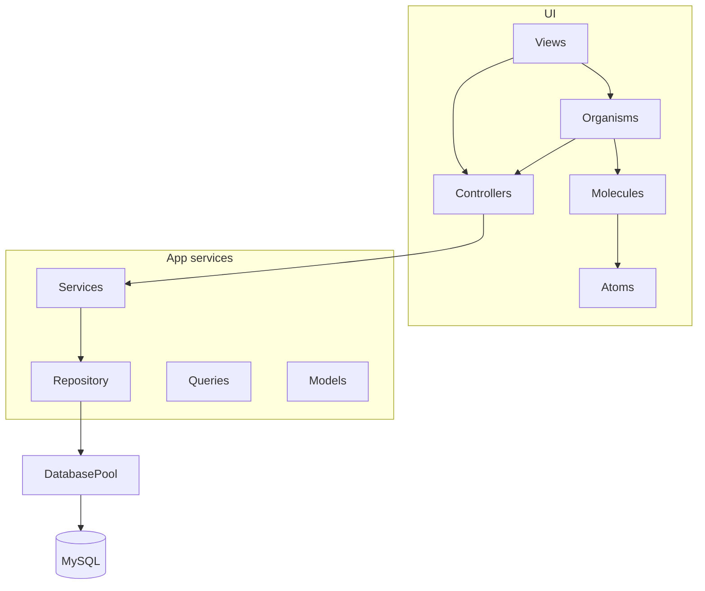

# Architecture

CanopyDB is a desktop MySQL client built with Java 25 and JavaFX 24. UI is constructed in Java (no FXML). Database work uses JDBC + HikariCP and runs off the JavaFX application thread.

## Stack

| Area | Choice |
| --- | --- |
| Language | Java 25 |
| UI | JavaFX 24 (`controls`; `fxml` is on the classpath but unused) |
| JDBC | MySQL Connector/J 9.x |
| Pool | HikariCP (max 10, idle timeout 30s) |
| JSON | Jackson databind |
| Build | Gradle (`application` + OpenJFX plugin) |
| Entry | `org.canopydb.Launch` → `Main` |

## Source layout

```
src/main/java/org/canopydb/
├── Launch.java, Main.java          # bootstrap
├── config/                         # pool, threads, logging, profiler
├── controllers/                    # UI ↔ async services
├── models/                         # domain DTOs
├── queries/                        # table browse SQL builders
├── repository/                     # JDBC
├── services/                       # CompletableFuture wrappers
├── utils/                          # non-UI helpers
└── ui/
    ├── Renderer.java
    ├── atoms/ molecules/ organisms/ views/
    ├── interfaces/                 # callbacks
    ├── singletons/                 # ViewManager, NotificationManager
    └── utils/                      # TableComponent, tree helpers, clipboard

src/main/resources/
├── styles/                         # split stylesheets (see Renderer)
│   ├── base.css
│   ├── workspace-related…          # topbar, sidebar, tree, tabs, table, …
│   └── connections.css
└── assets/logo.png
```

## Layering



| Layer | Responsibility |
| --- | --- |
| **Views** | Top-level screens (`ConnectionView`, `WorkspaceView`) implementing `View` |
| **Organisms** | Feature regions (connection manager/form, sidebar, workspace, table tab) |
| **Molecules / atoms** | Reusable widgets (cards, filter rows, pagination, text inputs) |
| **Controllers** | Wire expand/click/reload events to services; push toasts; call back into UI |
| **Services** | Run DAO work on `ThreadPool` via `CompletableFuture` |
| **Repository** | JDBC against `DatabasePool` |
| **Queries** | Build SELECT / COUNT SQL for table browse |
| **Models** | Immutable-ish DTOs and per-tab session state |

There is no DI framework. Wiring uses constructors and method references (e.g. `workspace::addNewSession`).

## Bootstrap

```
Launch.main
  → Main.main → Application.launch
    → Main.start(Stage)
         Renderer.render()
           StackPane[
             ViewManager.viewStack,
             NotificationManager.notificationContainer  (bottom-right)
           ]
           push ConnectionView
           Scene 1280×720 + /styles/*.css
         stage.show()
    → Main.stop() → ThreadPool.shutdown()
```

| Class | Role |
| --- | --- |
| `Launch` | Gradle `mainClass` |
| `Main` | JavaFX `Application`; title `CanopyDB - SQL Client` |
| `Renderer` | Root layout, initial view, stylesheet |
| `ViewManager` | Static `StackPane`; `pushView` / `popView` / `replaceView` |

Connecting successfully does `ViewManager.pushView(new WorkspaceView().getView())`, stacking the workspace on the connection screen. Disconnect UI is not wired yet (`DatabasePool.disconnect()` exists but is unused from the UI).

## Screens

### Connection view

`ConnectionView` — horizontal `SplitPane` (~30% / 70%):

- **Left:** `ConnectionManager` — saved connections, search, “New”, cards with environment labels (`ConnectionLabel`: Local / Dev / Prod / Testing).
- **Right:** `ConnectionFormArea` — welcome logo or `ConnectionForm` (Test / Save / Connect).

Persistence: `~/.canopydb/connections.json` (pretty-printed Jackson list of `ConnectionMeta`). Created on first run with a default “Local Instance” (`localhost:3306` / `root` / empty password / LOCAL). **Passwords are stored in plaintext.**

`ConnectionManager` owns connection defaults and load/save behavior; all JSON file I/O goes through `ClientStateManager` (see [Client state persistence](#client-state-persistence)).

| Action | Behavior |
| --- | --- |
| Test | Background thread → `DatabasePool.testConnection` (DriverManager; does not replace the pool) → toast |
| Connect | FX thread → `DatabasePool.connect` (Hikari) → save → push `WorkspaceView` |
| Save | Writes full connection list to JSON via `ClientStateManager`; Save button only when editing and form is dirty |

### Workspace view

`WorkspaceView` — `BorderPane`:

- **Left:** `Sidebar` — connection tree + search (`ConnectionTreeSearch`).
- **Center:** `Workspace` — multi-tab `TabPane` of open tables.

Callbacks from sidebar:

- `TableOpenAction` → `Workspace.addNewSession`
- `TableActiveCheck` → `Workspace.selectActiveSession` (if tab already open, focus it and skip re-fetch)

## Schema tree

```
Sidebar
  ConnectionTreeSearch  (debounce 180ms; filters loaded nodes only)
  TreeView
    TreeViewEventController
      ConnectionMetadataService → MetadataDAO   (SHOW DATABASES, information_schema)
      TableActionService → TableActionDAO       (table rows)
```

| Event | Behavior |
| --- | --- |
| Expand connection root | Load databases asynchronously |
| Expand database | Load table names for that schema |
| Double-click table node | Open or focus tab; fetch first page of data |
| Placeholders | Inline spinner on the expanding node (`LazyTreeItem`); failure collapses and retries on next expand |

Search keeps a snapshot of the loaded tree and projects a filtered tree via `TreeSearch.findLoadedMatches`. After loads, the controller calls `onTreeDataChanged` so an active search re-applies.

## Table browsing

Opening a table builds a `TableSession` (names + `TableQuery` + `TableData` + total count) and a `TableTab`:

```
TabFilterArea  |  TableView (TableComponent)  |  TableTabFooter (PaginationControls)
```

| Concern | Mechanism |
| --- | --- |
| Page size | Hard-coded `limit = 300` in `TableQuery` |
| Pagination | Offset via session helpers; footer prev/next; re-fetch |
| Filters | Up to 10 `FilterBox` rows; raw SQL fragments AND’d into `WHERE`; Apply / Applied toggle |
| Sort | Custom `TableView` sort policy → server-side `ORDER BY` (single column, ASC↔DESC) + re-fetch |
| Reload | `TableViewEventController.tableReRender` → `TableActionService.loadTableDataAsync(session)` → `Workspace.updateSession` |
| Copy | Context menus: cell value, row (CSV), column name header; null → `NULL`, empty → `__EMPTY__` |

SQL shape (simplified):

```sql
SELECT * FROM `database`.`table`
[WHERE (...)]
[ORDER BY `col` ASC|DESC]
LIMIT 300 OFFSET n
```

Filters are **not** parameterized column operators — they are developer-entered SQL snippets.

## Client state persistence

All on-disk client state lives under `~/.canopydb/`. **`ClientStateManager`** is the single control point for JSON file I/O; feature code owns defaults and domain rules.

```
Feature (e.g. ConnectionManager)
  → decides what to store / default seed data
  → ClientStateManager.write(filename, data)
  → ClientStateManager.read / readList(filename, type)
```

| Piece | Responsibility |
| --- | --- |
| `Constants` | State directory name (`.canopydb`), filenames (`connections.json`, …) |
| `ClientStateManager` | Path resolution, directory creation, Jackson read/write |
| Feature classes | When to load/save, default content, UI error handling |

| API | Use |
| --- | --- |
| `stateDirectory()` / `stateFilePath(filename)` | Resolve paths under `~/.canopydb/` |
| `exists(filename)` | Check before seeding a new file |
| `write(filename, data)` | Pretty-print JSON to disk |
| `read(filename, type)` | Read a single JSON object |
| `readList(filename, elementClass)` | Read a JSON array |

**Connections today:** `ConnectionManager.seedSavedConnections()` seeds a default list when `connections.json` is missing, then loads via `readList`. `handleSave()` writes the in-memory list with `write(Constants.CONNECTIONS_STATE_FILE, connections)`.

**Adding a new state file:** add a filename constant in `Constants`, keep feature-specific logic in the owning class, and call `ClientStateManager` for I/O only.

## Data model highlights

| Type | Role |
| --- | --- |
| `ConnectionMeta` | Saved connection (UUID id, host, port, credentials, label) |
| `CellValue` | Distinguishes SQL NULL (`ofNull`) from text (`of`); `toDisplayString()` for grid |
| `ColumnMeta` | Name + JDBC type metadata |
| `TableData` | Columns + rows of `CellValue` |
| `TableSession` | Per-open-tab state; owns `TableQuery` and pagination helpers |
| `TablePagination` | `(limit, offset, totalRows)` record |

### ResultSetValueSerializer

Maps each JDBC cell to `CellValue` with type-aware rules so display (and future edits) stay faithful:

- Temporals via `getString` (avoids MySQL zero-date failures from `getObject`)
- Numbers / booleans as plain strings
- BINARY/BLOB as `<BINARY N bytes>`
- `wasNull()` → `CellValue.ofNull()`

## Threading

| Piece | Thread |
| --- | --- |
| Metadata / table loads / connection test | `ThreadPool` (fixed size **4**) |
| UI mutations after async work | `Platform.runLater` |
| `DatabasePool.connect` | Currently **synchronous on the FX thread** (can block UI) |
| Shutdown | `Main.stop` shuts down the executor |

`Profiler.logMemory` logs used heap MB at a few UI hotspots (tab open, filter add, tree double-click).

## Notifications

`NotificationManager` overlays toasts on the root `StackPane`:

- Types: INFO, SUCCESS, DANGER
- Auto-dismiss: 3s (12s for DANGER)
- DANGER includes Copy; click toast opens a modal with full message
- Controllers use `ExceptionMessages.userMessage(...)` so toasts show the root SQL message, not Java wrapper chains

## Styling

Single theme, split files under `src/main/resources/styles/`, loaded in order by `Renderer` via `scene.getStylesheets().add(...)`.

- Dark surfaces (`#1f232a`, `#2b2d31`), accent `#5C3E94`
- Java attaches style classes (`getStyleClass().add(...)`); CSS owns colors/spacing
- Sections cover sidebar, tree, tabs, table, filters, pagination, notifications, connection cards/form, context menus

## Conventions

1. **No FXML** — build UI in constructors.
2. **Atomic UI** — prefer composing atoms/molecules over one-off layouts.
3. **One global pool** — one connected MySQL instance at a time.
4. **MySQL dialect** — quoting and metadata queries assume MySQL.
5. **Server-side browse** — filter/sort/page always re-query; do not sort the in-memory page as truth.
6. **Keep JDBC off the FX thread** (except today’s connect path).
7. **Null-aware cells** — never collapse SQL NULL into a plain empty string without `CellValue`.

## End-to-end path (navigation)

1. `Launch` → `Main.start` → `Renderer` → `ConnectionView`
2. Save / Test / Connect via `ConnectionFormArea` + `DatabasePool`
3. `WorkspaceView` → expand tree (`TreeViewEventController` / `MetadataDAO`)
4. Double-click table → `TableActionService` / `TableActionDAO` / `ResultSetValueSerializer`
5. `TableTab` → filter / sort / paginate → `TableQuery` + `tableReRender`

For class-level detail, see [Package reference](PACKAGE-REFERENCE.md).
